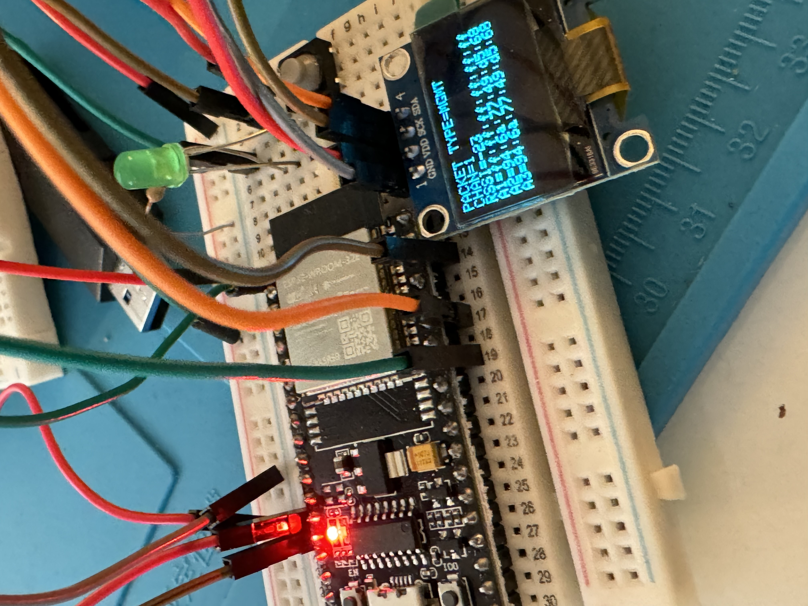
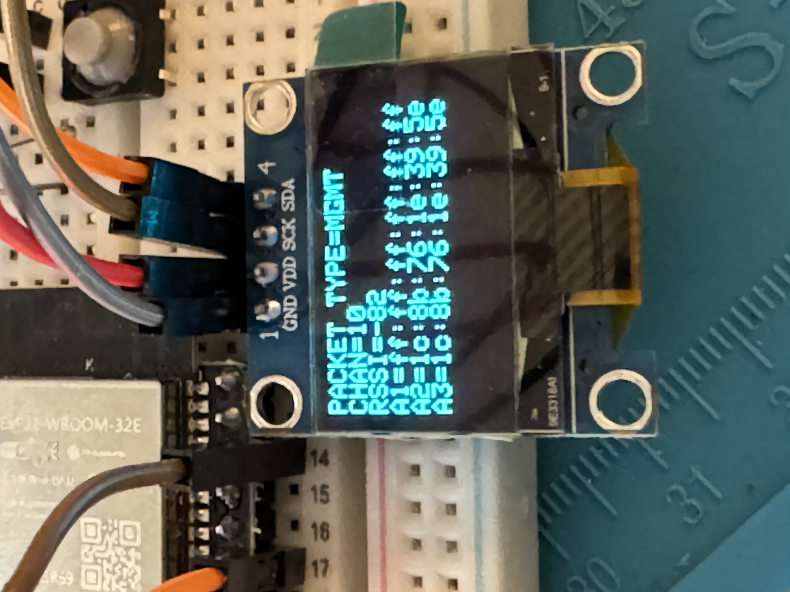

# ESP32-WiFi-Sniffer-SSD1306
This is a simple fork of the original project. I added support for SSD1306 screens, and this is tailored for the popular 0.96inch screens. Looks really crisp!
Will add SD card support soon!

</img>
</img>

## Wiring
Using ESP32 WROOM 32E, wiring is pretty straightforward.
I2C SSD1306 Screen > ESP32
SDA > GPIO21
SCK > GPIO22
VCC > 3V
GND > GND

# ESP32-WiFi-Sniffer
Simple WiFi sniffer for boards based on the Espressif Systems ESP32 module

The sketch shall be compiled with Arduino IDE configured with the proper ESP32 plugin (https://github.com/espressif/arduino-esp32).

The code is based on the work of Łukasz Podkalicki (http://blog.podkalicki.com/esp32-wifi-sniffer/) modified in order to be correctly compiled with Arduino IDE.
